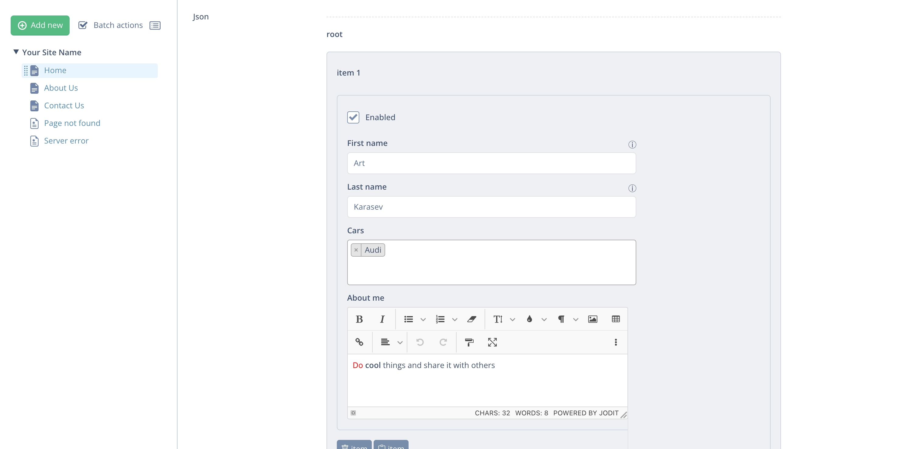

# 🦅 JSON Editor Field for Silverstripe

[](https://packagist.org/packages/spatie/schema-org)
[](https://packagist.org/packages/spatie/schema-org)
[](https://packagist.org/packages/spatie/schema-org)
[](https://packagist.org/packages/spatie/schema-org) 

Indispensable tool to work with JSON data. Makes it easy to handle any JSON schema in a user-friendly interface and adjusts the output for Silverstripe templates.

This module is using [json-editor](https://github.com/json-editor/json-editor) under the hood. Refer to its [README](https://github.com/json-editor/json-editor/blob/master/README.md) to learn more about JSON Schema, all field types, properties, and available options that you can use.



## Install

```
composer require goldfinch/json-editor
```

## Usage

```php
use Goldfinch\JSONEditor\Forms\JSONEditorField;
use Goldfinch\JSONEditor\ORM\FieldType\DBJSONText;

private static $db = [
    'Json' => DBJSONText::class,
];

public function getCMSFields()
{
    $fields = parent::getCMSFields();

    $fields->addFieldsToTab(
        'Root.Main',
        [
            JSONEditorField::create('Json', 'Json', $this),
        ]
    );
    
    return $fields;
}
```

(*) You can also use an extension instead.

```xml
Page:
  extensions:
    - Goldfinch\JSONEditor\Extensions\JsonDataExtension
```

Each JSON field must have a schema file. All schemas are stored within `app/_schema` directory.

Based on the example above, we can say that our `Page.php` has `Json` field, therefore our schema file should be named as `Page-Json.json` following `{class_name}-{field_name}.json` name rule.

Example:

#### 1) Create schema file
```
touch app/_schema/Page-Json.json
```

#### 2) Add schema

Let's add some schema to our `Page-Json.json` file

```json
{
  "type": "array",
  "options": {},
  "items": {
      "type": "object",
      "properties": {
          "enabled": {
              "title": "Enabled",
              "type": "boolean",
              "format": "checkbox",
              "default": "true"
          },
          "firstname": {
              "type": "string",
              "title": "First name",
              "options": {
                  "infoText": "Your first name"
              }
          },
          "lastname": {
              "type": "string",
              "title": "Last name",
              "options": {
                  "infoText": "Your last name"
              }
          },
          "cars": {
              "type": "array",
              "title": "Cars",
              "format": "select2",
              "uniqueItems": true,
              "items": {
                  "type": "string",
                  "enum": ["BMW", "Audi", "Volvo"]
              }
          },
          "about": {
              "type": "string",
              "title": "About me",
              "format": "jodit"
          }
      }
  }
}
```

#### 3) Output JSON data in Silverstripe template.

At this step, we can go and some JSON data through our field. Once we are done, we can output our pure JSON data using familiar Silverstripe syntax.

```html
<% with $Json.Parse %>
    <% loop Me %>
        <div><strong>First name:</strong> $firstname</div>
        <div><strong>Last name:</strong> $lastname</div>
        <div><strong>Cars:</strong> <% loop cars %><% if not IsFirst %>, <% end_if %>$Me<% end_loop %></div>
        <div><strong>About:</strong> $about</div>
    <% end_loop %>
<% end_with %>
```

## License

The MIT License (MIT)
